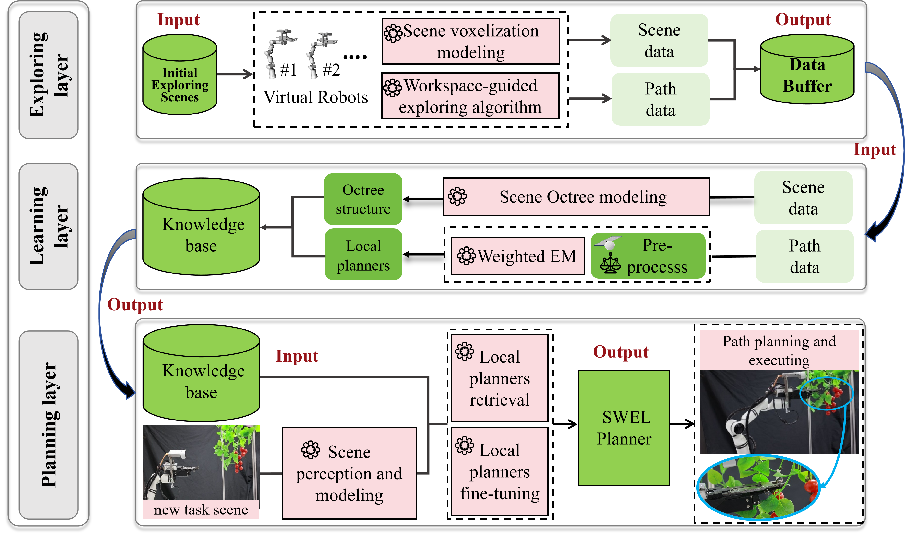
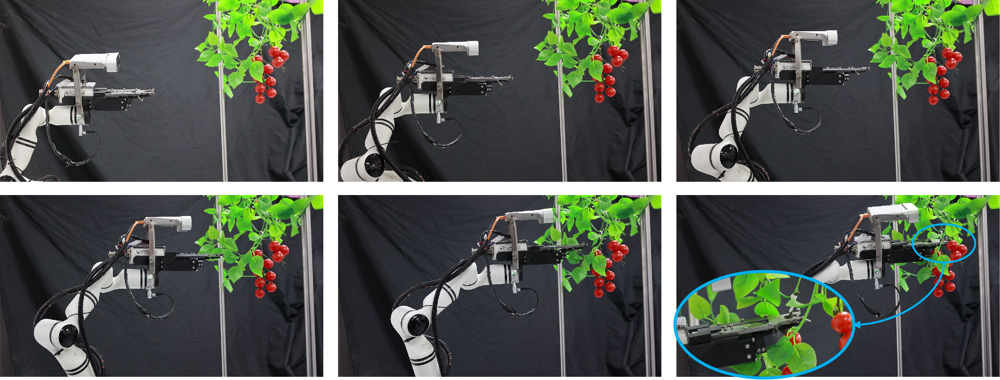

# SWEL-Planner
This is the source code of our proposed SWEL planner


ubuntu 20.04
ROS ros-noetic
moveit 1.1.16

```text
.
├── mpv2/                  # path planning algorithm
│   ├── scripts            # core codes
│   └── condig             # config
├── rm_moveit/             # moveit config
│   ├── launch             # rviz/gazebo launch
│   ├── config
│  
├── rm_description/        # robot file
│   └── meshes
    └── urdf               # URDF file
├── scene_describe/        # task scene modeling
│   ├── GMM
│   ├── scene-modeling
│   └── oct_Tree          
└── README.md


@inproceedings{huang2024neural,
  title={Neural Informed RRT*: Learning-based Path Planning with Point Cloud State Representations under Admissible Ellipsoidal Constraints},
  author={Huang, Zhe and Chen, Hongyu and Pohovey, John and Driggs-Campbell, Katherine},
  booktitle={2024 IEEE International Conference on Robotics and Automation (ICRA)},
  pages={8742--8748},
  year={2024},
  organization={IEEE}
}
